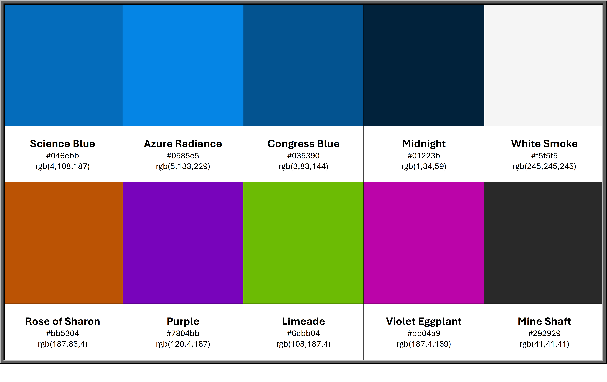

# ApprentiCalc - Milestone Project 2

**A website providing a user friendly Minimum Off-The-Job Hours (MinimumOTJH) calculator for apprenticeship standards as per the Insitute for Apprenticeships and Technical Education (IfATE) website and databse.**

## 1. Overview

Confused about minimum On-The-Job (OTJ) hours for your apprenticeship? ApprentiCalc is a simple and intuitive tool designed to quickly calculate the required minimum OTJ hours, helping apprentices and employers easily understand and track progress.

Navigating the requirements for apprenticeship On-The-Job (OTJ) hours can often feel complex and confusing. ApprentiCalc is designed to cut through the complexity and provide a clear, straightforward solution for both apprentices and employers. This intuitive online tool empowers users to quickly and accurately calculate the minimum OTJ hours mandated for their specific apprenticeship programme. By simplifying this crucial aspect of apprenticeship planning and management, ApprentiCalc helps ensure compliance with regulations and provides a transparent framework for tracking progress.

Whether you're an apprentice eager to understand your learning journey and milestones, or an employer striving to effectively manage and mentor your apprentices, ApprentiCalc offers a user-friendly platform to obtain the essential OTJ figures you need, saving you time and reducing the potential for errors.

## 2. Rationale

ApprentiCalc is an online tool developed to provide a straightforward and efficient means of calculating the minimum On-The-Job (OTJ) hours required for various apprenticeship programmes. Its primary objective is to simplify the process of understanding and determining these essential training requirements for both apprentices and employers.

The inspiration for ApprentiCalc arose from observing the often confusing and time-consuming nature of deciphering apprenticeship OTJ guidelines. Many individuals and organisations struggle to readily access and accurately calculate these figures, leading to potential misunderstandings, administrative burdens, and even non-compliance. This project aims to address this gap by providing a user-friendly and readily accessible solution.

Apprenticeships are a vital pathway for skills development and workforce training. A key component of any apprenticeship is the mandated On-The-Job training, which ensures practical experience alongside theoretical learning. However, the specific minimum hours required can vary significantly depending on the sector, level, and governing body of the apprenticeship. This variability often necessitates careful review of complex documentation and manual calculations, which can be prone to error and inefficient.

The core problem that ApprentiCalc seeks to resolve is the difficulty and inefficiency associated with determining the minimum required On-The-Job training hours for apprenticeships. This can lead to wasted time for administrators, potential misinterpretations of regulations, and uncertainty for apprentices regarding their training progress.

ApprentiCalc offers a user-friendly online platform where users can input relevant details about their apprenticeship (e.g., sector, level, duration). The tool will then automatically calculate and display the minimum required OTJ hours based on pre-loaded or easily configurable parameters. Key features include an intuitive interface, clear presentation of results, and the potential for future integration of specific apprenticeship frameworks. This approach provides a unique and accessible alternative to manual calculations and sifting through lengthy documents.

ApprentiCalc offers several advantages over current methods. It provides a significant time-saving for administrators and apprentices alike. The automated calculations reduce the risk of human error, ensuring greater accuracy and compliance. Furthermore, the clear and accessible output empowers apprentices to better understand their training requirements and track their progress effectively. For employers, it streamlines the management of apprenticeship programmes and aids in ensuring adherence to regulatory standards.

The initial scope of ApprentiCalc focuses on providing accurate calculations for a range of common apprenticeship frameworks. Acknowledged limitations include the need for ongoing updates to reflect changes in regulations and the potential initial focus on specific sectors. Potential future enhancements for ApprentiCalc include the integration of progress tracking features, the ability to save and export calculations, the inclusion of links to relevant regulatory documents, and the expansion to cover a wider range of apprenticeship frameworks and regions.

In summary, ApprentiCalc addresses a significant need by providing a user-friendly and accurate solution for calculating minimum apprenticeship On-The-Job training hours. By simplifying this process, the tool has the potential to save time, reduce errors, improve understanding, and ultimately contribute to the more effective management and successful completion of apprenticeships.

## 3. User Experience (UX)

### User Stories

#### Feature 1: Apprenticeship Standard Lookup & Display

**As an ApprentiCalc user,** I want to select an apprenticeship standard from a dynamic list so that I can immediately view its essential details like LARS number, funding, and duration, informing my understanding of the program.

**Acceptance Criteria:**

- A dropdown menu is present that lists available apprenticeship standards.
- The dropdown options are dynamically populated from an external data source (e.g., `standard.xml`).
- The options in the dropdown are sorted numerically by their LARS value for easy navigation.
- Upon selecting an option, key details of that standard (e.g., ID, LARS Number, Title, Name, Level, Maximum Funding, Duration in Months, Duration in Weeks) are automatically displayed in read-only input fields.
- The displayed details accurately reflect the selected standard's data.
- The detail fields are arranged clearly (e.g., side-by-side on larger screens, stacked on smaller screens).

**Tasks:**

- Develop JavaScript to asynchronously fetch and parse the `standard.xml` file.
- Implement JavaScript to dynamically populate the dropdown (`<select>`) element with standard titles (display) and IDs (value), ensuring sorting by LARS.
- Create HTML structure for the dropdown and the read-only input fields that will display standard details.
- Implement a JavaScript event listener on the dropdown's `change` event to retrieve the selected standard's data and populate the detail fields.
- Apply CSS (e.g., Bootstrap grid system) to arrange the detail fields responsively.
- Ensure proper error handling if the XML data cannot be loaded.

#### Feature 2: Accurate OTJ Hour Calculation

**As an apprentice or employer,** I want to accurately calculate the minimum On-The-Job (OTJ) training hours required for an apprenticeship so that I can ensure compliance and effective planning.

**Acceptance Criteria:**

- The tool calculates the duration of the practical period (A to B) in days.
- The tool calculates the duration of the practical period (A to B) in weeks, rounded to the nearest whole number.
- The tool accurately calculates the statutory leave duration (F) based on the planned apprenticeship duration.
- The tool correctly calculates the total apprenticeship duration for calculation (G) in weeks, excluding statutory leave.
- The tool correctly calculates the total apprenticeship duration for calculation (H) in hours, applying a 30-hour cap for apprenticeships starting on or after 1 August 2022.
- The tool accurately calculates the minimum off-the-job training required (I) as 20% of the total apprenticeship duration for calculation in hours, rounded to a whole number.

**Tasks:**

- Implement date difference calculation for days (D) and weeks (E).
- Develop the statutory leave calculation logic (F).
- Implement the total duration for calculation in weeks (G).
- Implement the total duration for calculation in hours, including the 30-hour cap logic (H).
- Implement the final 20% OTJ calculation and rounding for Field I.
- Conduct unit tests for all calculation formulas with various inputs (including edge cases like short durations, exactly 52 weeks, dates around Aug 1, 2022).

#### Feature 3: Immediate Input Validation and Feedback

**As a user,** I want clear and immediate alerts if I miss mandatory input fields or enter invalid data, so that I can quickly correct my entries and successfully get a calculation.

**Acceptance Criteria:**

- An alert is displayed if the "Practical period start date (A)" field is empty.
- An alert is displayed if the "Practical period end date (B)" field is empty.
- An alert is displayed if "Weekly working hours (C)" is empty, not a number, or less than or equal to zero.
- An alert is displayed if a provided date for A or B is not a valid date (e.g., "2023-02-30").
- If multiple input issues exist, all relevant error messages are displayed simultaneously in a single alert.
- Calculations do not proceed until all mandatory fields are valid.

**Tasks:**

- Implement JavaScript checks for empty date fields (A, B).
- Implement JavaScript checks for invalid numerical input in weekly hours (C).
- Implement JavaScript checks for "Invalid Date" objects after parsing date inputs.
- Modify the validation logic to collect all error messages into an array and display them collectively.
- Ensure the calculation function returns immediately if any validation errors are present.

#### Feature 4: Clear Calculation Breakdown Display

**As a user,** I want to see a clear breakdown of each step of the OTJ hour calculation (D through H) and the final result (I) so that I can understand how the figures are derived.

**Acceptance Criteria:**

- Each calculation step (D, E, F, G, H, I) is displayed in a dedicated, clearly labelled output field.
- The output fields are read-only to prevent user modification.
- The display for "Minimum off-the-job training required (I)" has a distinct visual style (e.g., different background color) to highlight it as the primary result.
- Numerical outputs are formatted consistently (e.g., days/weeks as whole numbers where appropriate, hours/weeks as two decimal places where needed for precision).

**Tasks:**

- Ensure all output fields (D-I) are correctly associated with their respective calculation results.
- Verify that output fields are set to `readonly` in HTML.
- Apply the specified CSS styling to the 'I' field.
- Review and ensure appropriate `toFixed()` or `Math.round()` methods are applied for display formatting.

#### Feature 5: Easy Reset Functionality

**As a user,** I want a prominent "Reset" button that clears all input and output fields, so that I can easily start a new calculation without manually deleting previous entries.

**Acceptance Criteria:**

- A "Reset" button is clearly visible and clickable on the page.
- Clicking the "Reset" button clears the values from all input fields (A, B, C).
- Clicking the "Reset" button clears the values from all calculated output fields (D-I).
- The page loads with all input and output fields cleared by default.

**Tasks:**

- Implement the `resetCalculator` JavaScript function to clear all relevant input and output field values.
- Attach an event listener to the "Reset" button to call `resetCalculator` on click.
- Configure `window.onload` to call `resetCalculator` for initial page state.

### Design

- **Colour Scheme**

  As the project is based around apprenticeships and OTJ Calculations, the colours have been based on the Insitute for Apprenticeships and Technical Education (IfATE) logo. The below colour palette was generated from the IfATE logo using [IMAGECOLORPICKER.com](https://imagecolorpicker.com/)

  

- **Typography**

  The ["Merriweather Sans"](https://fonts.google.com/specimen/Merriweather+Sans) font family has been selected as the main font used throughout the whole project with Sans Serif as the fallback font in any case that the font isn't being imported into the project correctly. Merriweather Sans is a classified as a variable font which allow one font file to contain multiple variations. You can change the weight, width, style, optical size, and more. The variables within variable fonts are controlled by axes.

  The ["Tauri"](https://fonts.google.com/specimen/Tauri) font family has been selected as the heading element font. Tauri is classified as a static font and is not as versitile as a variable font, hence why this is used for heading elements only. Tauri is a semi condensed sans typeface with a sense of restraint, clarity and rigor. Tauri's unique qualities do not shout and instead emerge slowly and organically as it is used.

### Imagery

This website utilises a variety of images to enhance the user experience and convey information effectively. The images serve several purposes:

- **Branding:** The logo (`assets/images/logo.png`) is used in the navigation bar to reinforce brand identity and provide a consistent visual element throughout the site.

- **Informational Images:** Images are incorporated within the card components (`assets/images/apprenticeship.jpg`, `assets/images/apprenticeship-2.jpg`, `assets/images/apprenticeship-3.jpg`, `assets/images/apprenticeship-4.jpg`) to illustrate concepts, break up text, and make the content more engaging. These images are carefully selected to be relevant to the surrounding information.

- **Favicon:** A favicon (`assets/favicon/apple-icon.png`, `assets/favicon/favicon-32x32.png`, `assets/favicon/favicon-16x16.png`) is included to provide a visual cue for the website in browser tabs and bookmarks. This also provides a first look in to the brand of the website.

All images used on the website are optimised for web performance to ensure fast loading times and a smooth user experience. Alternative text (alt text) is provided for all images to ensure accessibility for users with visual impairments and to improve SEO. The alt text descriptions are concise and descriptive, accurately conveying the content and purpose of each image.

### Wireframes

- [Home Page Wireframe](assets/readme/wireframe-home.png)
- [Calculator Page Wireframe](assets/readme/wireframe-your-guide.png)

## 3. Features

- **Homepage with Clear ApprentiCalc Overview:**
  - A concise and informative introduction explaining the purpose of ApprentiCalc (simplifying OTJ hour calculation) and its benefits for apprentices and employers.
  - Highlights the tool's focus on accuracy, compliance, and time-saving for apprenticeship planning and management.
  - Guides users to the main calculation interface or the apprenticeship standard lookup.

- **Core On-The-Job (OTJ) Calculation Functionality:**
  - Provides intuitive input fields for apprenticeship start date, end date, and weekly working hours.
  - Accurately calculates the planned apprenticeship duration in days and weeks.
  - Precisely determines statutory leave duration in weeks based on the apprenticeship length.
  - Computes the total apprenticeship duration for calculation (in weeks and hours) after deducting leave.
  - Applies specific rules, such as capping weekly working hours at 30 for apprenticeships starting on or after 1 August 2022.
  - Calculates the minimum required OTJ training hours as 20% of the total apprenticeship duration in hours, rounded to the nearest whole number.

- **Dynamic Apprenticeship Standard Lookup & Display:**
  - Features a dynamic dropdown list allowing users to select a specific apprenticeship standard.
  - Populates the dropdown options by fetching and parsing data from an external XML file (e.g., `standard.xml`).
  - Automatically displays essential details of the selected standard, such as its ID, LARS Number, Title, Name, Level, Maximum Funding, and Duration in Months and Weeks, in read-only fields.
  - Presents standard details in a clear, organized layout (e.g., side-by-side on larger screens, stacked on smaller screens).

- **Intuitive User Interaction and Feedback:**
  - Implements immediate validation upon calculation, providing clear, combined alerts if mandatory input fields are missing or data is invalid (e.g., invalid dates, non-positive weekly hours).
  - Displays a step-by-step breakdown of all intermediate calculation results (D through H) in clearly labelled, read-only output fields.
  - Highlights the final "Minimum off-the-job training required" field (I) with a distinct background color for easy identification.
  - Includes a prominent "Reset" button that clears all input and output fields, allowing users to easily start a new calculation.

- **Responsive and Accessible Design:**
  - Website layout seamlessly adapts to various screen sizes and orientations, ensuring optimal usability on desktops, laptops, tablets, and mobile phones.
  - All input fields, buttons, and output displays are functionally accessible and clearly visible across different devices.
  - Utilizes standard web practices to ensure basic accessibility (e.g., clear labels, sufficient color contrast, keyboard navigability for interactive elements).
  - Maintains separation of HTML structure, CSS styling, and JavaScript logic in distinct files for improved maintainability and organization.

## 4. Technology Used

ApprentiCalc, an interactive tool designed to simplify apprenticeship On-The-Job (OTJ) hour calculations and provide apprenticeship standard details, was built using a combination of front-end web development technologies to ensure an accurate, responsive, and user-friendly experience.

- **HTML5:** HTML5 was used as the foundation for the calculator's structure and content. Semantic HTML5 elements were employed to create a logical and accessible document outline, enhancing readability and maintainability.

- **CSS3:** CSS3 was used for styling the calculator's interface and controlling its visual presentation. Custom CSS rules were written to define the layout, typography, colours, and specific visual highlights, such as the distinct background color for the final OTJ hour output.

- **JavaScript:** JavaScript is the core of ApprentiCalc's interactivity and logic. It was used to implement all custom functionalities, including:
  - Fetching and parsing external XML data for apprenticeship standard lookup.
  - Performing all complex date and numerical calculations for OTJ hours.
  - Implementing robust input validation and providing consolidated error feedback.
  - Dynamically updating the user interface based on inputs and calculations.
  - Handling event listeners for user interactions (e.g., button clicks, dropdown selections).

- **XML:** An external XML file (`standard.xml`) serves as the data source for apprenticeship standard details within the calculator's lookup feature. JavaScript's `fetch` API and `DOMParser` are utilized to asynchronously load and interpret this structured data.

- **Bootstrap 5:** Bootstrap 5, a popular front-end framework, was utilized to create a responsive and mobile-first design for the calculator's layout. Its grid system facilitates flexible arrangement of input and output fields, ensuring seamless adaptation to different screen sizes.

- **Font Awesome:** Font Awesome icons were integrated into the website to enhance visual appeal and improve user experience. Icons were used to represent different sections and concepts, making the content more engaging and easier to understand. The use of icons also contributes to a more intuitive navigation experience.

- **CDN (Content Delivery Network):** External libraries, such as Bootstrap's CSS and JavaScript, are loaded from a CDN. This optimizes loading times by utilizing geographically distributed servers to deliver content efficiently.

## 5. Installation

To view and run the ApprentiCalc website locally, follow these steps:

1. **Clone the Repository:**
    - Open your terminal or command prompt.
    - Navigate to the directory where you want to store the project.
    - Execute the following command:

        ```bash
        git clone https://github.com/jdpclarke/Milestone-Project-2.git
        ```

2. **Navigate to the Project Directory:**
    - Use the `cd` (change directory) command to enter the cloned project folder:

        ```bash
        cd Milestone-Project-2
        ```

3. **Open `index.html` in Your Web Browser:**
    - Locate the `index.html` file within the project directory.
    - Double-click the `index.html` file to open it in your default web browser.
    - Alternatively, you can right-click the file and select "Open with" followed by your preferred web browser (Chrome, Firefox, Safari, Edge, etc.).

4. **View the Website:**
    - The ApprentiCalc website should now be displayed in your browser.
    - You can navigate through the different pages and sections of the website.

**Note:**

- This project is a static website, meaning it does not require a web server to run locally. You can simply open the HTML files directly in your browser.
- Ensure you have a modern web browser installed on your computer to view the website correctly.
- If you wish to make changes to the code, you can use a text editor or code editor (e.g., VS Code) to edit the HTML, CSS, and JavaScript files.
- If you have made changes to the website, simply save the files and refresh your browser to view the updated content.
- If you have not got git installed you can also download the zip file of the repository, and extract it to your chosen location.

## 6. Usage

ApprentiCalc is designed as an intuitive tool for quickly calculating minimum On-The-Job (OTJ) training hours and looking up apprenticeship standard details. Here's a guide to effectively using the calculator:

**1. Interface Overview:**

- **Input Fields Section:** This area is where you provide the necessary details for your calculation, including dates and weekly working hours.
- **Calculation Breakdown Section:** This section dynamically displays the step-by-step results of the OTJ calculation.
- **Action Buttons:** Clearly labeled buttons are provided to trigger calculations and reset the tool.
- **Responsive Design:** The entire calculator interface adapts to different screen sizes, ensuring usability on desktops, tablets, and mobile devices.

**2. Selecting an Apprenticeship Standard:**

- **Standard Selection Dropdown:** Use the dropdown menu (if available on your version) to choose an apprenticeship standard.
- **Automatic Detail Display:** Upon selecting a standard, its key details (e.g., ID, LARS Number, Title, Name, Level, Maximum Funding, Duration in Months, Duration in Weeks) will automatically populate the read-only fields below the dropdown, providing immediate context.

**3. Performing On-The-Job (OTJ) Calculation:**

- **Enter Dates:** Input the "Practical period start date (A)" and "Practical period end date (B)" using the date pickers.
- **Enter Weekly Hours:** Provide the "Weekly working hours (C)". Note that the system will automatically cap this at 30 hours if your apprenticeship starts on or after 1 August 2022.
- **Initiate Calculation:** Click the "Calculate Off-the-Job Training" button to process your inputs and display the results.

**4. Understanding Calculation Results:**

- **Breakdown Fields (D-H):** Review the "Calculation Breakdown" section. Each field (Planned apprenticeship duration in days/weeks, Statutory leave duration, Total duration for calculation in weeks/hours) details an intermediate step in the calculation.
- **Minimum OTJ Required (I):** The final calculated "Minimum off-the-job training required (in hours)" is highlighted with a distinct background color for easy identification, representing the core output.

**5. Resetting the Calculator:**

- **Reset Button:** To clear all entered data and calculated results, click the "Reset" button. This prepares the calculator for a new entry.

**6. Input Validation and Feedback:**

- **Alert Messages:** If any mandatory fields are left blank or invalid data is entered (e.g., incorrect date format, non-positive hours), an alert box will appear.
- **Consolidated Feedback:** All identified errors will be displayed in a single alert message, prompting you to correct all issues before proceeding with the calculation.

**7. Important Note & Disclaimer:**

- **Information Only:** This calculator provides an estimation of minimum OTJ hours for informational purposes only.
- **Seek Professional Advice:** It is not a substitute for professional advice. Always refer to official government guidance (e.g., ESFA rules) and consult with a certified training provider or careers advisor for definitive and personalised advice regarding apprenticeship requirements.

## 7. Testing

**1. Comprehensive Manual Testing:**

The ApprentiCalc tool was thoroughly tested across a variety of browsers and devices to ensure functionality, responsiveness, and accuracy of calculations and data display.

**Browsers and Devices Tested:**

- **Chrome (Version 132.0.6834.197 (Official Build) (64-bit)):** Used as the primary testing browser.
- **Chrome Developer Tools:** Employed to simulate various screen sizes and mobile devices, including:
  - Common mobile device resolutions (e.g., iPhone, Android).
  - Tablet screen sizes.
  - Various desktop viewport widths.

**Testing Conducted:**

- **Input & Calculation Logic Testing:**
  - **Valid Data Inputs:** Tested calculations with various valid combinations of practical period start/end dates and weekly working hours.
  - **Edge Cases for Dates:** Tested with start and end dates on the same day, consecutive days, durations spanning exactly 52 weeks, and very long/short durations.
  - **Weekly Hours Scenarios:** Tested with minimum valid hours, higher hours (e.g., 40 hours) to verify the 30-hour cap logic, and fractional hours if allowed.
  - **Date of Start Impact:** Specifically tested scenarios where the "Practical period start date (A)" is on or after 1 August 2022 to confirm the 30-hour cap is correctly applied to "Total duration for calculation (H)".
  - **Calculation Accuracy:** Verified that all intermediate calculations (D, E, F, G, H) and the final "Minimum off-the-job training required (I)" are accurate against expected values (e.g., using a known reference like the ESFA calculator or manual calculations).
  - **Statutory Leave (F) Verification:** Confirmed the correct calculation of statutory leave based on the practical period duration.

- **Apprenticeship Standard Lookup Testing:**
  - **Dropdown Population:** Verified that the dropdown is correctly populated with all available apprenticeship standards from the XML data, and that they are sorted numerically by LARS value.
  - **Selection & Display:** Tested selecting various standards from the dropdown to ensure the correct details (ID, LARS, Title, Name, Level, Max Funding, Duration) are accurately displayed in the read-only fields.
  - **XML Data Integrity:** Confirmed that the displayed data perfectly matches the source `standard.xml` file for selected standards.
  - **Initial State:** Checked that the standard lookup section loads correctly, either with a default selection or empty fields, upon page load.

- **Validation Testing:**
  - **Missing Inputs:** Tested attempting calculation with "Practical period start date (A)", "Practical period end date (B)", and "Weekly working hours (C)" fields left empty.
  - **Invalid Date Formats:** Inputted non-date strings or invalid dates (e.g., "2023-02-30") into date fields.
  - **Invalid Weekly Hours:** Inputted non-numeric, zero, negative, or excessively high values into the "Weekly working hours (C)" field.
  - **Consolidated Alerts:** Verified that all detected validation errors are displayed simultaneously in a single, clear alert message.
  - **Calculation Prevention:** Confirmed that calculations do not proceed if any validation errors are present.

- **Reset Functionality Testing:**
  - **Full Clear:** After entering data and performing a calculation, tested the "Reset" button to ensure all input fields (A, B, C) and all output fields (D-I, plus standard lookup details) are cleared correctly.
  - **Initial State Consistency:** Confirmed that the reset state matches the initial loaded state of the calculator.

- **Responsiveness & Layout Testing:**
  - **Viewport Adaptation:** Tested the calculator's layout (input fields, buttons, calculation breakdown, standard lookup display) across various screen sizes using Chrome Developer Tools, ensuring elements rearrange and resize gracefully.
  - **Readability on Mobile:** Verified that text and numbers remain readable on smaller screens without excessive scrolling or truncation.
  - **Button Accessibility:** Ensured buttons are clickable and visible on all device sizes.
  - **Input Field Sizing:** Checked that input fields are appropriately sized for touch interaction on mobile devices.

- **Accessibility Testing:**
  - **Keyboard Navigation (Focus Order):** Mapped the precise focus order of interactive elements (input fields, dropdown, buttons) using the Tab key, ensuring a logical and intuitive sequence.
  - **Color Contrast:** Used color contrast analyzer tools to verify that text and background colors throughout the calculator meet WCAG accessibility guidelines, especially for the highlighted final result (I).
  - **Labels and Descriptions:** Confirmed all input fields and calculation outputs have clear and descriptive labels.

**Bug Evaluation and Fixes:**

- **Bug 1: Incorrect 30-Hour Cap Application:**
  - Description: The 30-hour weekly cap was not applied correctly for apprenticeships starting exactly on 1 August 2022, or was misapplied to earlier starts.
  - Fix: Refined the conditional logic for `if (startDate >= new Date('2022-08-01'))` to ensure precise date comparison and correct application of the cap.
- **Bug 2: Date Field Clearing Issue on Reset:**
  - Description: Upon clicking "Reset," date input fields (A and B) were not fully clearing or were reverting to a default date instead of being empty.
  - Fix: Ensured the reset function explicitly sets the `value` of date input fields to an empty string `''`.
- **Bug 3: Standard Lookup Details Not Resetting:**
  - Description: After selecting a standard and then hitting "Reset," the displayed standard details (ID, LARS, etc.) remained populated.
  - Fix: Modified the `resetCalculator` function to also clear the content or values of all read-only input fields in the apprenticeship standard display section.
- **Bug 4: Combined Validation Message Display:**
  - Description: When multiple input errors occurred, separate alert boxes would pop up instead of a single consolidated message.
  - Fix: Modified the validation logic to collect all error messages into an array and then display them within a single `alert()` call or a dedicated message area.
- **Bug 5: Layout Break on Small Mobile Viewports:**
  - Description: On very narrow mobile screens, input fields or buttons would overlap or break out of their containers.
  - Fix: Adjusted Bootstrap column classes (e.g., ensuring appropriate `col-12` or `col-md-6` usage) and added custom CSS media queries to refine spacing and element stacking on smaller viewports.
- **Bug 6: XML Data Loading Failure:**
  - Description: If the `standard.xml` file was not found or failed to load, the standard dropdown would remain empty without user feedback.
  - Fix: Implemented error handling within the `fetch` API call (using `.catch()`) to log the error and display a user-friendly message if the standard data cannot be loaded.

**Unfixed Bugs:**

- At the present time, all found bugs have been fixed.

**Screenshots and User Story Fulfillment:**

- **Main Calculator Interface:**
  [Screenshot of the ApprentiCalc main interface with inputs and calculate button visible, before calculation](assets/readme/usf-screenshot-calc-1.png)
  - **User Story Fulfilled:** "As an apprenticeship provider/learner, I want to quickly and accurately calculate the minimum On-The-Job (OTJ) training hours for an apprenticeship."
  - **Explanation:** This screenshot highlights the user-friendly interface of ApprentiCalc, showcasing the clear input fields for dates and weekly hours, and the prominent "Calculate" button. It demonstrates how users can easily initiate the core calculation process.

- **Apprenticeship Standard Lookup in Action:**
  [Screenshot of the ApprentiCalc with an apprenticeship standard selected from the dropdown, showing its details populated in the read-only fields below](assets/readme/usf-screenshot-calc-2.png)
  - **User Story Fulfilled:** "As an apprenticeship professional, I want to easily look up details for a specific apprenticeship standard, such as its LARS number, level, and funding band."
  - **Explanation:** This screenshot illustrates the functionality of the apprenticeship standard lookup. It shows a standard being selected from the dropdown and its associated details instantly populating the relevant fields, fulfilling the need for quick access to standard information.

- **Completed OTJ Calculation with Breakdown:**
  [Screenshot of the ApprentiCalc after a successful calculation, showing all input fields, the full calculation breakdown (D-H), and the final highlighted result (I)](assets/readme/usf-screenshot-calc-3.png)
  - **User Story Fulfilled:** "As a user, I want to understand how the OTJ hours are calculated, so I can verify the results and explain them to others."
  - **Explanation:** This screenshot presents the calculator after a successful computation. It clearly displays the step-by-step calculation breakdown (fields D through H) leading to the final highlighted "Minimum off-the-job training required (I) in hours", allowing users to comprehend and verify the logic.

- **Validation and Error Feedback:**
  [Screenshot of the ApprentiCalc showing an alert message for invalid or missing inputs](assets/readme/usf-screenshot-calc-4.png)
  - **User Story Fulfilled:** "As a user, I want clear feedback if I enter incorrect or incomplete information, so I can correct my inputs easily."
  - **Explanation:** This screenshot captures the calculator's input validation in action, showing the alert message that appears when mandatory fields are left empty or invalid data is entered. This demonstrates that the tool provides immediate and consolidated feedback, guiding users to correct errors.

- **Reset Functionality:**
  [Screenshot of the ApprentiCalc in its initial, cleared state after the reset button has been pressed](assets/readme/usf-screenshot-calc-5.png)
  - **User Story Fulfilled:** "As a user, I want to be able to reset the calculator to its initial state quickly, so I can perform new calculations without manually clearing fields."
  - **Explanation:** This screenshot shows the calculator after a user has pressed the "Reset" button. All input and output fields are cleared, demonstrating the convenience of initiating a new calculation without manual data deletion.

- **Mobile Responsiveness:**
  Screenshots showing the calculator on [iPhone 12/Common Mobile Resolution](assets/readme/usf-screenshot-calc-6-1.png) | [iPad Mini/Common Tablet Resolution](assets/readme/usf-screenshot-calc-6-2.png)
  - **User Story Fulfilled:** "As a user, I want the calculator to be accessible and usable on different devices, including mobile phones and tablets."
  - **Explanation:** These screenshots illustrate the calculator's responsive design, adapting its layout seamlessly to smaller screen sizes of mobile phones and tablets. This confirms that users can effectively interact with the tool regardless of their device.

- **Accessibility (Keyboard Navigation Focus):**
  [Screenshot showing keyboard focus clearly visible on an interactive element (e.g., a date input field or the Calculate button](assets/readme/usf-screenshot-calc-7.png)
  - **User Story Fulfilled:** "As a user, I want the calculator to be fully navigable using a keyboard for accessibility purposes."
  - **Explanation:** This screenshot demonstrates the clear visual focus indicator when navigating the calculator using the Tab key. It confirms that interactive elements are easily identifiable for users who rely on keyboard input, enhancing accessibility.

## 8. Deployment

This project, ApprentiCalc, was deployed using GitHub Pages, making it accessible directly from a GitHub repository.

**GitHub Pages Deployment:**

The project was deployed to GitHub Pages using the following steps:

1. **Log in to GitHub and locate the GitHub Repository:** Navigate to the project's repository on GitHub: [https://github.com/jdpclarke/Milestone-Project-2.git](https://github.com/jdpclarke/Milestone-Project-2.git)
2. **Access Repository Settings:** At the top of the repository (not the top of the page), locate the "Settings" button on the menu.
3. **Navigate to GitHub Pages Section:** Scroll down the Settings page until you find the "Pages" section.
4. **Select Deployment Branch:** Under "Source," click the dropdown menu and select the branch you wish to deploy (usually "main" or "master").
5. **GitHub Pages Deployment:** The page will automatically refresh, and GitHub Pages will deploy the site from the selected branch.
6. **Access the Deployed Site:** Scroll back down the page to the "Pages" section to find the published site link.

**Forking the GitHub Repository:**

To create a copy of this repository on your own GitHub account, allowing you to view and modify the code without affecting the original, follow these steps:

1. **Log in to GitHub and locate the GitHub Repository:** Navigate to the project's repository on GitHub: [https://github.com/jdpclarke/Milestone-Project-2.git](https://github.com/jdpclarke/Milestone-Project-2.git)
2. **Fork the Repository:** At the top of the repository (not the top of the page), just above the "Settings" button, locate the "Fork" button and click it.
3. **Your Forked Copy:** You will now have a copy of the original repository in your GitHub account.

**Making a Local Clone:**

To download a local copy of this repository to your computer, follow these steps:

1. **Log in to GitHub and locate the GitHub Repository:** Navigate to the project's repository on GitHub: [https://github.com/jdpclarke/Milestone-Project-2.git](https://github.com/jdpclarke/Milestone-Project-2.git)
2. **Clone or Download:** Under the repository name, click "Code."
3. **Copy HTTPS Link:** Under "Clone with HTTPS," copy the provided link.
4. **Open Git Bash (or your terminal):** Open your Git Bash terminal (or your preferred terminal).
5. **Change Directory:** Change the current working directory to the location where you want the cloned directory to be created using the `cd` command.
6. **Clone the Repository:** Type `git clone` and then paste the URL you copied in Step 3. Press Enter.

    ```bash
    git clone [https://github.com/jdpclarke/Milestone-Project-2.git](https://github.com/jdpclarke/Milestone-Project-2.git)
    ```

7. **Local Clone Created:** Your local clone will be created in the specified directory.

## 9. Credits

This ApprentiCalc project was developed using a combination of publicly available resources, open-source libraries, and original content. Here is a more detailed breakdown of the credits:

**Content and Information:**

- **Education and Skills Funding Agency (ESFA):** The core informational content regarding apprenticeship OTJ calculation rules and the data for apprenticeship standards (e.g., LARS, funding bands) was derived from official ESFA guidance and related UK government publications. This ensured the accuracy and relevance of the calculations and standard details presented.
- **UK Government Publications:** Relevant government publications and reports related to apprenticeship funding and requirements were consulted to inform the calculation logic.

**Technologies and Libraries:**

- **HTML5:** The semantic structure of the calculator's web page was built using HTML5, ensuring accessibility and clear document outline.
- **CSS3:** Custom styles and layouts were implemented using CSS3, including the creation of responsive designs for various screen sizes and specific visual enhancements for the calculator interface.
- **JavaScript:** Primarily used for implementing all custom calculator logic, including date and numerical computations, input validation, dynamic display updates, and asynchronous data fetching and parsing.
- **XML:** External XML files serve as the data source for apprenticeship standard details, parsed dynamically by JavaScript.
- **Bootstrap 5:** The Bootstrap 5 framework was used to create a responsive and consistent user interface for the calculator. This included utilizing Bootstrap's grid system and styling for form elements.

**Code and Assets:**

- **Bootstrap 5 Documentation:** The Bootstrap 5 documentation was extensively referenced for code examples, component usage, and responsive design guidelines.
- **Custom CSS:** The `style.css` file contains custom CSS rules written by the developer to enhance and tailor the calculator's appearance beyond the default Bootstrap styles.
- **Custom JavaScript:** The `standard-script.js` and `calculator-script.js` contain custom JavaScript code written by the developer for the calculator's logic, validation, calculations, and dynamic content updates.

**Acknowledgements:**

- **Open-Source Community:** The developer acknowledges the contributions of the open-source community for providing the tools, libraries, and resources used in this project.
- **Code Institute:** The developer acknowledges the support and guidance provided by Code Institute throughout the project's development.
- **Feedback Providers:** The developer expresses gratitude to anyone who provides feedback, testing, or suggestions for improvement on this project.

## 10. Future Improvements

ApprentiCalc is a foundational tool, and several enhancements can be implemented to further improve its functionality and user experience.

**1. Enhanced Apprenticeship Standard Data & Integration:**

- **Richer Standard Details:** Expand the data points for each apprenticeship standard beyond current details (e.g., specific entry requirements, typical job roles).
- **Direct Calculation Integration:** Allow the duration selected from the standard lookup to directly populate the calculator's end date, streamlining the process.
- **Integrating TNP Reduction Calculations:** Incorporate logic to automatically calculate Total Negotiated Price (TNP) reductions for apprenticeship programs that are delivered over a reduced duration.
- **Filtering/Search for Standards:** Implement search and filtering options for the apprenticeship standards dropdown if the list becomes extensive.

**2. User Customization and Persistence:**

- **Save Common Inputs:** Allow users to save frequently used inputs (e.g., common weekly hours) for quick recall.
- **Historical Calculations:** Implement a feature to view or save previous calculation results.

**3. Contextual Help and Guidance:**

- **Tooltips/Information Icons:** Add tooltips or information icons next to input and output fields to provide quick explanations of terms or rules (e.g., explanation of 30-hour cap).
- **Links to Official Guidance:** Provide direct links within the calculator interface to specific sections of official ESFA or UK government guidance relevant to particular calculation rules.

**4. Performance and Maintainability:**

- **Code Refactoring:** Continuously refactor the codebase to improve performance, readability, and long-term maintainability.
- **Asset Optimization:** Optimize any images or other assets used on the page to reduce loading times.

**5. Regulatory Updates Mechanism:**

- **Automated Rule Updates:** Explore methods for more easily updating calculation rules (e.g., new 20% requirements, changes to leave entitlement) as government regulations evolve, possibly through an external configuration.
